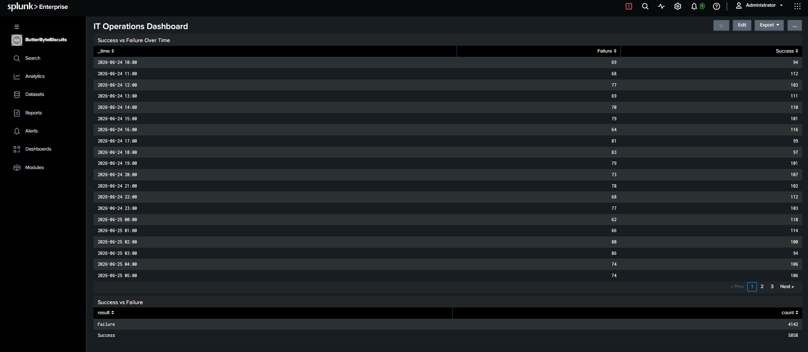
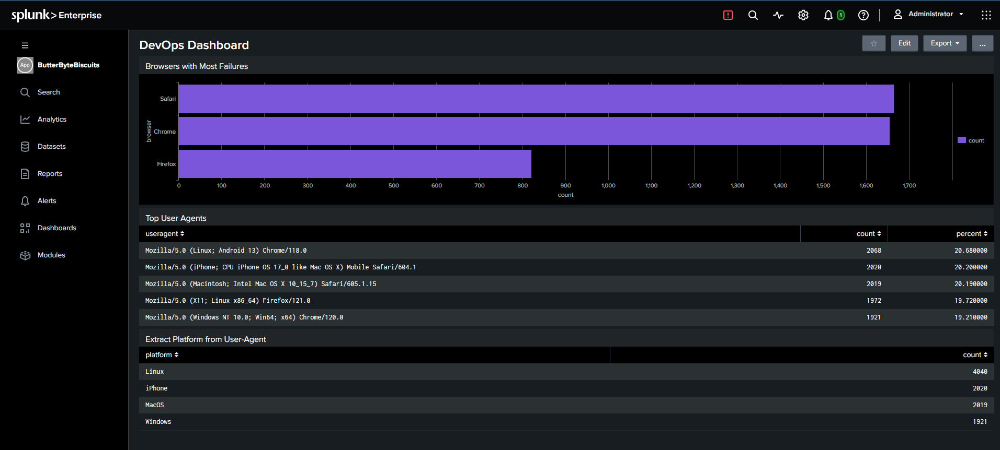
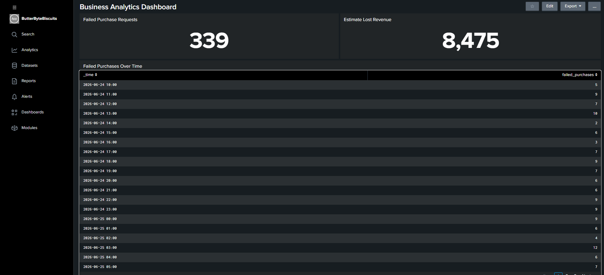
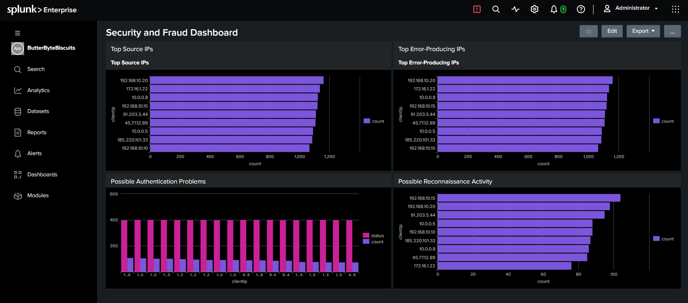
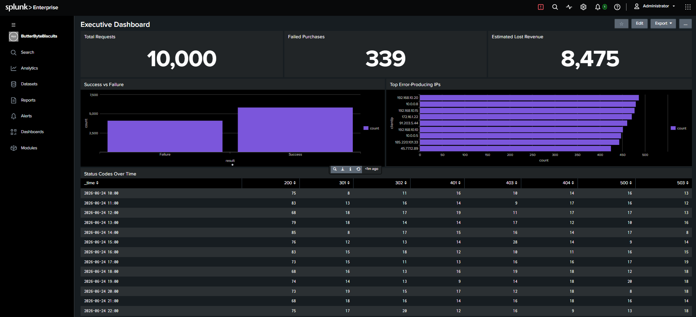

#  Splunk Web Monitoring & SOC Investigation

> Enterprise SIEM Portfolio Project demonstrating operational monitoring, business analytics, security investigation, dashboard development, and incident response using Splunk Enterprise.

#  Repository Structure

```text
splunk-web-monitoring-soc-investigation/
│
├── architecture/
│   ├── splunk_architecture.png
│   ├── data_flow.png
│   └── soc_workflow.png
│
├── dashboards/
│   ├── IT_Operations_Dashboard.png
│   ├── DevOps_Dashboard.png
│   ├── Business_Analytics_Dashboard.png
│   ├── Security_Dashboard.png
│   └── Executive_Dashboard.png
│
├── dataset/
│   └── generate_weblogs.py
│
├── incident_response/
│   ├── Executive_Summary.md
│   ├── Incident_Playbook.md
│   ├── SOC_Level1_Investigation.md
│   └── SOC_Level2_Escalation.md
│
├── screenshots/
├── spl_queries/
├── docs/
├── LICENSE
└── README.md
```
#  Author

**Olufemi Oluyomi**

This project was developed as part of my cybersecurity portfolio to demonstrate practical experience with Splunk Enterprise, Security Information and Event Management (SIEM), Search Processing Language (SPL), operational monitoring, and Security Operations Centre (SOC) investigations.

Feel free to connect with me on LinkedIn or explore my GitHub repositories for additional cybersecurity and cloud engineering projects.
---

##  Project Overview

This project demonstrates the deployment and use of **Splunk Enterprise** as a Security Information and Event Management (SIEM) platform for monitoring and analysing simulated Apache web server logs.

Using a realistic business scenario based on **ButterByte Biscuits Ltd**, the project showcases how machine data can be transformed into actionable operational, business, and security insights through the use of Search Processing Language (SPL), dashboards, and structured investigation techniques.

The project demonstrates how a Junior SOC Analyst can use Splunk Enterprise to transform raw machine data into operational, business, and security intelligence through structured investigation and dashboard-driven analysis.

---
#  Business Scenario

ButterByte Biscuits Ltd is a fictional online retailer used to simulate a realistic enterprise environment. Recently, the organisation experienced increasing customer complaints relating to website availability, failed purchases, and inconsistent user experience. At the same time, the IT department observed a rise in web server errors and unusual request patterns that required further investigation.

Management required a solution capable of collecting and analysing machine-generated data to answer several key business questions:

- Is the website operating normally?
- Which browsers and operating systems are most commonly used?
- How many customer purchases are failing?
- What is the estimated financial impact of failed purchases?
- Is there evidence of suspicious or potentially malicious web activity?

To address these challenges, Splunk Enterprise was deployed as the central Security Information and Event Management (SIEM) platform. Simulated Apache access logs were generated using Python and ingested into Splunk, where Search Processing Language (SPL) was used to analyse operational, business, and security events through interactive dashboards.

Rather than focusing solely on cybersecurity, this project demonstrates how a single dataset can provide valuable insights for multiple stakeholders, including IT Operations, DevOps engineers, Business Analysts, Security Operations Centre (SOC) analysts, and Executive Management.
#  Project Objectives

The objectives of this project were to:

- Deploy Splunk Enterprise on Ubuntu Linux.
- Generate realistic Apache-style web server logs using Python.
- Configure Splunk data inputs to ingest machine-generated logs.
- Perform operational monitoring using Search Processing Language (SPL).
- Develop dashboards for different business stakeholders.
- Investigate suspicious web activity using log analysis techniques.
- Estimate business impact from failed customer purchases.
- Document findings using structured SOC investigation practices.
- Present technical results in a professional GitHub portfolio.
#  Skills Demonstrated

Throughout this project, the following technical and analytical skills were demonstrated:

### Security Information and Event Management (SIEM)

- Splunk Enterprise deployment
- Data onboarding
- Search Processing Language (SPL)
- Dashboard development
- Log analysis

### Security Operations

- Security event investigation
- Threat hunting
- Incident response documentation
- Evidence-based analysis
- SOC workflow

### DevOps & IT Operations

- Website monitoring
- Browser and operating system analysis
- HTTP status monitoring
- Service health monitoring

### Business Analytics

- Failed transaction analysis
- Business KPI reporting
- Estimated revenue impact
- Executive dashboard development

### Technical Skills

- Ubuntu Linux
- Python
- Apache Access Logs
- Git
- GitHub
- Visual Studio Code

#  Technologies Used

| Technology | Purpose |
|------------|---------|
| Splunk Enterprise | Log collection, analysis, dashboards, and security monitoring |
| Ubuntu Linux | Operating system hosting Splunk Enterprise |
| Python | Generation of simulated Apache web logs |
| Apache Access Logs | Source dataset used throughout the project |
| Search Processing Language (SPL) | Query language for searching and analysing machine data |
| Git | Version control |
| GitHub | Source code and documentation management |
| Visual Studio Code | Project documentation and Markdown editing |

#  Solution Architecture

The project simulates a real-world Security Information and Event Management (SIEM) environment in which machine-generated Apache web server logs are collected, indexed, analysed, and visualised using Splunk Enterprise.

The solution consists of five primary components:

1. **Python Log Generator** – Generates realistic Apache-style web server logs.
2. **Apache Access Log Dataset** – Stores simulated HTTP requests.
3. **Splunk Enterprise** – Collects, indexes, and analyses log data.
4. **Interactive Dashboards** – Present operational, business, DevOps, and security insights.
5. **SOC Investigation Process** – Uses SPL searches to investigate suspicious behaviour and document findings.

The overall architecture is illustrated below.

> 
**Figure 1.** High-level solution architecture illustrating the end-to-end workflow from simulated Apache log generation through Splunk data ingestion, SPL analysis, dashboard development, and SOC decision-making.

#  Data Pipeline

The project follows a structured data pipeline that transforms raw machine data into actionable operational and security intelligence.

1. Python generates simulated Apache web server logs.
2. Log files are written to the Ubuntu filesystem.
3. Splunk monitors the log directory.
4. Events are indexed into the `main` index.
5. Search Processing Language (SPL) queries analyse the indexed events.
6. Interactive dashboards visualise the results.
7. SOC analysts investigate suspicious activity and document findings.

> *

**Figure 2.** End-to-end data pipeline illustrating how simulated Apache web server logs are generated, monitored, indexed, transformed into searchable events, and analysed using Splunk Enterprise dashboards.

#  Project Workflow

The project follows a structured monitoring and investigation workflow similar to that used within a Security Operations Centre (SOC).

1. Generate simulated web server logs.
2. Configure Splunk data inputs.
3. Onboard Apache log data.
4. Validate field extraction.
5. Develop dashboards for different stakeholders.
6. Perform operational monitoring.
7. Conduct business analytics.
8. Investigate suspicious web activity.
9. Document findings.
10. Present executive-level summaries.

> *## SOC Investigation Workflow


**Figure 3.** Security Operations Centre (SOC) investigation workflow illustrating the structured process followed by analysts when investigating suspicious activity, assessing risk, collecting evidence, escalating incidents, and reporting findings.*

# Dashboard Development

To demonstrate how different stakeholders extract value from the same machine data, five dashboards were developed using Splunk Enterprise.

Each dashboard focuses on a different operational objective:

| Dashboard | Primary Audience | Purpose |
|-----------|------------------|---------|
| IT Operations | System Administrators | Monitor website availability and service health |
| DevOps | Development Team | Analyse browser usage and platform compatibility |
| Business Analytics | Business Managers | Monitor failed purchases and estimate revenue impact |
| Security Investigation | SOC Analysts | Detect suspicious activity and investigate threats |
| Executive Dashboard | Senior Management | Provide high-level operational and security KPIs |

#  IT Operations Dashboard

## Purpose

The IT Operations dashboard was designed to provide operational visibility into the health and availability of the ButterByte Biscuits web application.

Using Apache web server logs, the dashboard enables system administrators to monitor request volumes, HTTP response codes, and overall service behaviour.

The objective is to identify operational issues quickly before they affect customer experience.

---

### Key Metrics

- Website request volume
- HTTP response status distribution
- Successful versus failed requests
- Web server health
- Operational trends over time

---

### SPL Techniques Used

Throughout this dashboard the following SPL commands were applied:

- `stats`
- `timechart`
- `count`
- `sort`
- `eval`

These commands transform raw machine data into operational metrics suitable for real-time monitoring.

---

### Business Value

The dashboard enables IT Operations teams to:

- Detect service degradation.
- Identify spikes in server errors.
- Monitor application availability.
- Reduce troubleshooting time.
- Improve overall service reliability.

---

### Skills Demonstrated

- Splunk dashboard development
- Operational monitoring
- Search Processing Language (SPL)
- Apache web log analysis
- Time-series analysis
- Data visualisation

---

> **Figure 4.** IT Operations Dashboard.

*

#  DevOps Dashboard

## Purpose

The DevOps Dashboard provides insight into how users interact with the ButterByte Biscuits web application across different browsers and operating systems. By analysing Apache access logs, the dashboard helps identify compatibility issues, browser-specific failures, and platform usage trends that may affect application performance and user experience.

---

### Key Metrics

- Browser distribution
- Operating system distribution
- Browser-specific failures
- HTTP error trends by platform
- User-Agent analysis

---

### SPL Techniques Used

The following SPL commands were used throughout the DevOps dashboard:

- `eval`
- `case`
- `like`
- `stats`
- `sort`

These commands were used to extract browser and operating system information from User-Agent strings and summarise the results into meaningful visualisations.

---

### Business Value

The dashboard enables development teams to:

- Identify browser compatibility issues.
- Detect operating system-specific errors.
- Improve customer experience across platforms.
- Validate software releases.
- Support troubleshooting after deployments.

---

### Skills Demonstrated

- Search Processing Language (SPL)
- User-Agent parsing
- Browser analytics
- Operating system analytics
- DevOps monitoring
- Data visualisation

---

### Dashboard Visualisation



**Figure 5.** DevOps dashboard showing browser usage, operating system distribution, and platform-specific operational metrics.

#  Business Analytics Dashboard

## Purpose

The Business Analytics Dashboard demonstrates how machine-generated web logs can provide meaningful business insights. Rather than focusing solely on infrastructure or cybersecurity, this dashboard measures customer purchase failures and estimates their financial impact.

---

### Key Metrics

- Failed purchase attempts
- Failed purchases over time
- Estimated lost revenue
- Business KPIs

---

### SPL Techniques Used

The following SPL commands were used:

- `stats`
- `timechart`
- `eval`
- `sum`

These searches transform operational log data into business-focused metrics that can support management decision-making.

---

### Business Value

The dashboard enables business stakeholders to:

- Monitor customer transaction failures.
- Estimate potential revenue loss.
- Identify periods of increased transaction failures.
- Improve customer satisfaction.
- Prioritise operational improvements.

---

### Skills Demonstrated

- Business analytics
- KPI development
- Revenue estimation
- Search Processing Language (SPL)
- Dashboard development
- Executive reporting

---

### Dashboard Visualisation



**Figure 6.** Business Analytics dashboard showing failed purchases, transaction trends, and estimated revenue impact.

#  Security Investigation Dashboard

## Purpose

The Security Investigation Dashboard was developed to support Security Operations Centre (SOC) analysts in identifying unusual web activity, analysing HTTP errors, and investigating potentially malicious behaviour.

Rather than confirming attacks, the dashboard provides evidence that supports structured investigation and informed decision-making.

---

### Key Metrics

- Top source IP addresses
- Error-producing IP addresses
- HTTP 404 activity
- Authentication failures
- Suspicious request patterns

---

### SPL Techniques Used

The dashboard makes use of:

- `stats`
- `count`
- `sort`
- `where`
- `table`

These searches allow analysts to summarise large volumes of machine data into actionable security intelligence.

---

### Security Value

The dashboard enables analysts to:

- Detect unusual request patterns.
- Identify possible reconnaissance activity.
- Investigate suspicious IP addresses.
- Prioritise events for investigation.
- Support incident escalation.

---

### Skills Demonstrated

- Threat hunting
- Log analysis
- Security monitoring
- Incident investigation
- SIEM operations
- Search Processing Language (SPL)

---

### Dashboard Visualisation



**Figure 7.** Security Investigation dashboard supporting web log analysis, threat hunting, and SOC investigations.

#  Executive Dashboard

## Purpose

The Executive Dashboard consolidates operational, business, and security metrics into a single high-level view designed for senior management. Rather than displaying technical details, it presents key performance indicators (KPIs) that support strategic decision-making.

---

### Key Metrics

- Website availability
- Failed purchases
- Estimated revenue impact
- Security events
- Operational health

---

### Business Value

The Executive Dashboard enables leadership to:

- Monitor overall service performance.
- Understand business impact.
- Track operational trends.
- Review security posture.
- Support evidence-based decision-making.

---

### Skills Demonstrated

- Executive reporting
- Dashboard design
- KPI development
- Data visualisation
- Business communication

---

### Dashboard Visualisation



**Figure 8.** Executive dashboard providing a consolidated overview of operational, business, and security performance indicators.

#  Lessons Learned

This project provided practical experience in deploying and using Splunk Enterprise within a simulated enterprise environment. It demonstrated how machine-generated data can be transformed into meaningful operational, business, and security insights.

Key lessons learned include:

- The importance of structured data onboarding for accurate analysis.
- How Search Processing Language (SPL) converts raw logs into actionable information.
- The value of dashboards for different stakeholder groups.
- The role of evidence-based investigation during SOC operations.
- The importance of documenting findings using a repeatable incident response process.
- How clear technical documentation improves knowledge sharing and project maintainability.

#  Future Improvements

Several enhancements could be implemented to extend this project:

- Integrate real Apache or Nginx web server logs.
- Configure Splunk alerts for suspicious events.
- Add GeoIP enrichment for source IP analysis.
- Integrate threat intelligence feeds.
- Forward logs from multiple systems using the Splunk Universal Forwarder.
- Build correlation searches and risk-based alerts.
- Integrate IDS data (e.g. Suricata or Snort) for multi-source investigations.
- Create scheduled reports for executive stakeholders.
